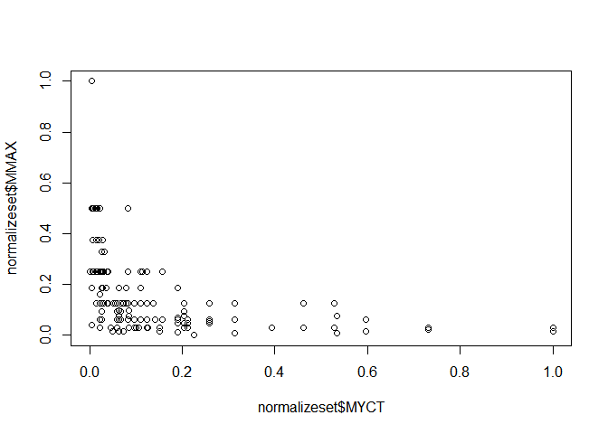
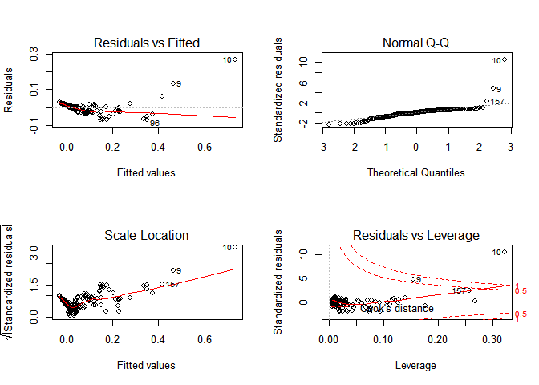
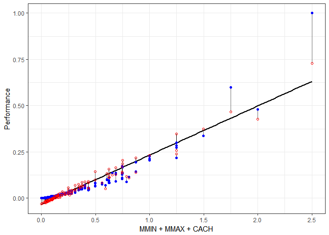

Linear Regression on CPU-Performance Dataset
================
Bhasheyam Krishnan

Loading the dataset

``` r
cpu = read.csv(file = "CPUPerformance.csv")
head(cpu)
```

    ##    Vendor MYCT MMIN  MMAX CACH CHMIN CHMAX Performance
    ## 1 adviser  125  256  6000  256    16   128         199
    ## 2  amdahl   29 8000 32000   32     8    32         253
    ## 3  amdahl   29 8000 32000   32     8    32         253
    ## 4  amdahl   29 8000 32000   32     8    32         253
    ## 5  amdahl   29 8000 16000   32     8    16         132
    ## 6  amdahl   26 8000 32000   64     8    32         290

``` r
a = c(1,2,3,4,NA)
b = c(2,3,4,5,6)
tes = as.data.frame(a)
tes$b = b
tes
```

    ##    a b
    ## 1  1 2
    ## 2  2 3
    ## 3  3 4
    ## 4  4 5
    ## 5 NA 6

``` r
tes1 = function(x){
  is.na(x)
}
apply(tes,2,tes1)
```

    ##          a     b
    ## [1,] FALSE FALSE
    ## [2,] FALSE FALSE
    ## [3,] FALSE FALSE
    ## [4,] FALSE FALSE
    ## [5,]  TRUE FALSE

``` r
nacheck = function(x){
  if (is.numeric(x)){
    mean(x)
    }
  
}

apply(cpu,2,nacheck)
```

    ## NULL

``` r
sum(is.na(tes))
```

    ## [1] 1

``` r
cpu[cpu == ""] = NA
sum(is.na(cpu))
```

    ## [1] 0

``` r
sum(is.null(cpu))
```

    ## [1] 0

the dataset has no NA and missing values

``` r
summary(cpu)
```

    ##        Vendor         MYCT             MMIN            MMAX      
    ##  ibm      : 32   Min.   :  17.0   Min.   :   64   Min.   :   64  
    ##  nas      : 19   1st Qu.:  50.0   1st Qu.:  768   1st Qu.: 4000  
    ##  honeywell: 13   Median : 110.0   Median : 2000   Median : 8000  
    ##  ncr      : 13   Mean   : 203.8   Mean   : 2868   Mean   :11796  
    ##  sperry   : 13   3rd Qu.: 225.0   3rd Qu.: 4000   3rd Qu.:16000  
    ##  siemens  : 12   Max.   :1500.0   Max.   :32000   Max.   :64000  
    ##  (Other)  :107                                                   
    ##       CACH            CHMIN            CHMAX         Performance     
    ##  Min.   :  0.00   Min.   : 0.000   Min.   :  0.00   Min.   :  15.00  
    ##  1st Qu.:  0.00   1st Qu.: 1.000   1st Qu.:  5.00   1st Qu.:  28.00  
    ##  Median :  8.00   Median : 2.000   Median :  8.00   Median :  45.00  
    ##  Mean   : 25.21   Mean   : 4.699   Mean   : 18.27   Mean   :  99.33  
    ##  3rd Qu.: 32.00   3rd Qu.: 6.000   3rd Qu.: 24.00   3rd Qu.: 101.00  
    ##  Max.   :256.00   Max.   :52.000   Max.   :176.00   Max.   :1238.00  
    ## 

The above is the stat of the datset

``` r
dim(cpu)
```

    ## [1] 209   8

``` r
boxplot(Filter(is.numeric,cpu))
```


From the above we can see almost every features has some outlier

so lets normalize the data see how it works

``` r
calculatenorm=function(x){
  num=x-min(x)
  denom=max(x)-min(x)
  return (num/denom)
}

normalizeset= as.data.frame(lapply(Filter(is.numeric,cpu),calculatenorm))
normalizeset
```

    ##            MYCT        MMIN        MMAX       CACH      CHMIN       CHMAX
    ## 1   0.072825354 0.006012024 0.092842843 1.00000000 0.30769231 0.727272727
    ## 2   0.008091706 0.248496994 0.499499499 0.12500000 0.15384615 0.181818182
    ## 3   0.008091706 0.248496994 0.499499499 0.12500000 0.15384615 0.181818182
    ## 4   0.008091706 0.248496994 0.499499499 0.12500000 0.15384615 0.181818182
    ## 5   0.008091706 0.248496994 0.249249249 0.12500000 0.15384615 0.090909091
    ## 6   0.006068780 0.248496994 0.499499499 0.25000000 0.15384615 0.181818182
    ## 7   0.004045853 0.498997996 0.499499499 0.25000000 0.30769231 0.181818182
    ## 8   0.004045853 0.498997996 0.499499499 0.25000000 0.30769231 0.181818182
    ## 9   0.004045853 0.498997996 1.000000000 0.25000000 0.30769231 0.181818182
    ## 10  0.004045853 1.000000000 1.000000000 0.50000000 0.61538462 0.363636364
    ## 11  0.258260283 0.029308617 0.045920921 0.00000000 0.01923077 0.011363636
    ## 12  0.258260283 0.014028056 0.053741241 0.01562500 0.01923077 0.034090909
    ## 13  0.028995280 0.060621242 0.124124124 0.25390625 0.01923077 0.045454545
    ## 14  0.022252192 0.123246493 0.249249249 0.25390625 0.01923077 0.045454545
    ## 15  0.224544842 0.000000000 0.000000000 0.00000000 0.01923077 0.022727273
    ## 16  0.123398517 0.014028056 0.249249249 0.00000000 0.07692308 0.181818182
    ## 17  0.101146325 0.014403808 0.030280280 0.03125000 0.07692308 0.085227273
    ## 18  0.084962913 0.014028056 0.077202202 0.00000000 0.13461538 0.181818182
    ## 19  0.084962913 0.029308617 0.030280280 0.00000000 0.09615385 0.090909091
    ## 20  0.062710722 0.154559118 0.077202202 0.55468750 0.15384615 0.363636364
    ## 21  0.084962913 0.044964930 0.097535035 0.00000000 0.09615385 0.181818182
    ## 22  0.084962913 0.095065130 0.095970971 0.00000000 0.09615385 0.113636364
    ## 23  0.084962913 0.070015030 0.095970971 0.00000000 0.11538462 0.363636364
    ## 24  0.062710722 0.095065130 0.095970971 0.00000000 0.11538462 0.363636364
    ## 25  0.204315577 0.002004008 0.092842843 0.00000000 0.01923077 0.068181818
    ## 26  0.204315577 0.014028056 0.030280280 0.01562500 0.01923077 0.017045455
    ## 27  0.204315577 0.006012024 0.092842843 0.00000000 0.01923077 0.034090909
    ## 28  0.204315577 0.006012024 0.045920921 0.01562500 0.01923077 0.017045455
    ## 29  0.204315577 0.014028056 0.077202202 0.01562500 0.01923077 0.028409091
    ## 30  0.204315577 0.006012024 0.077202202 0.01562500 0.01923077 0.034090909
    ## 31  0.005394471 0.039015531 0.039977477 0.51171875 0.23076923 0.136363636
    ## 32  0.005394471 0.039015531 0.039977477 0.51171875 0.23076923 0.136363636
    ## 33  0.022252192 0.080035070 0.162912913 0.11718750 0.23076923 0.136363636
    ## 34  0.022252192 0.080035070 0.162912913 0.11718750 0.23076923 0.136363636
    ## 35  0.026298045 0.162074148 0.326983233 0.11718750 0.23076923 0.136363636
    ## 36  0.031692515 0.162074148 0.326983233 0.11718750 0.23076923 0.136363636
    ## 37  0.022252192 0.013652305 0.030280280 0.03125000 0.01923077 0.022727273
    ## 38  0.022252192 0.029308617 0.061561562 0.03125000 0.01923077 0.028409091
    ## 39  0.022252192 0.060621242 0.124124124 0.03125000 0.01923077 0.028409091
    ## 40  0.022252192 0.029308617 0.061561562 0.03125000 0.05769231 0.028409091
    ## 41  0.022252192 0.029308617 0.124124124 0.03125000 0.05769231 0.028409091
    ## 42  0.022252192 0.060621242 0.249249249 0.03125000 0.05769231 0.028409091
    ## 43  0.022252192 0.060621242 0.249249249 0.03125000 0.05769231 0.034090909
    ## 44  0.022252192 0.060621242 0.249249249 0.03125000 0.05769231 0.034090909
    ## 45  0.078219825 0.029308617 0.186686687 0.03515625 0.05769231 0.068181818
    ## 46  0.078219825 0.029308617 0.124124124 0.03515625 0.05769231 0.068181818
    ## 47  0.534726905 0.014028056 0.007007007 0.03125000 0.01923077 0.005681818
    ## 48  0.534726905 0.029308617 0.077202202 0.00000000 0.01923077 0.005681818
    ## 49  0.204315577 0.014028056 0.124124124 0.01562500 0.01923077 0.028409091
    ## 50  0.123398517 0.014028056 0.124124124 0.03125000 0.01923077 0.045454545
    ## 51  0.460552933 0.010020040 0.124124124 0.00000000 0.01923077 0.005681818
    ## 52  0.460552933 0.006012024 0.030280280 0.00000000 0.01923077 0.005681818
    ## 53  0.082939987 0.029308617 0.249249249 0.06250000 0.01923077 0.017045455
    ## 54  0.123398517 0.029308617 0.124124124 0.00000000 0.01923077 0.011363636
    ## 55  0.062710722 0.029308617 0.061561562 0.06250000 0.01923077 0.011363636
    ## 56  0.062710722 0.029308617 0.186686687 0.06250000 0.01923077 0.011363636
    ## 57  0.136884693 0.029308617 0.124124124 0.06250000 0.01923077 0.011363636
    ## 58  0.527983817 0.006012024 0.124124124 0.00000000 0.01923077 0.022727273
    ## 59  0.527983817 0.006012024 0.124124124 0.00000000 0.01923077 0.022727273
    ## 60  0.527983817 0.006012024 0.124124124 0.00000000 0.01923077 0.022727273
    ## 61  0.527983817 0.006012024 0.124124124 0.00000000 0.01923077 0.022727273
    ## 62  0.527983817 0.006012024 0.124124124 0.00000000 0.01923077 0.022727273
    ## 63  0.072825354 0.014028056 0.014639640 0.00000000 0.15384615 0.113636364
    ## 64  0.039109912 0.060621242 0.124124124 0.25000000 0.01923077 0.215909091
    ## 65  0.039109912 0.060621242 0.249249249 0.25000000 0.01923077 0.215909091
    ## 66  0.039109912 0.060621242 0.249249249 0.50000000 0.01923077 0.215909091
    ## 67  0.049224545 0.006012024 0.014639640 0.00000000 0.05769231 0.056818182
    ## 68  0.059339177 0.006012024 0.030280280 0.00000000 0.05769231 0.056818182
    ## 69  0.059339177 0.029308617 0.061561562 0.00000000 0.05769231 0.136363636
    ## 70  0.059339177 0.060621242 0.061561562 0.03125000 0.05769231 0.107954545
    ## 71  0.039109912 0.060621242 0.124124124 0.03125000 0.05769231 0.136363636
    ## 72  0.039109912 0.091933868 0.124124124 0.03125000 0.05769231 0.272727273
    ## 73  0.106540796 0.006012024 0.030280280 0.00000000 0.05769231 0.136363636
    ## 74  0.190829400 0.022044088 0.045920921 0.00000000 0.11538462 0.136363636
    ## 75  0.190829400 0.022044088 0.045920921 0.02343750 0.11538462 0.136363636
    ## 76  0.190829400 0.022044088 0.186686687 0.02343750 0.11538462 0.136363636
    ## 77  0.190829400 0.022044088 0.069381882 0.00000000 0.01923077 0.136363636
    ## 78  0.190829400 0.010020040 0.186686687 0.02343750 0.01923077 0.136363636
    ## 79  0.190829400 0.004008016 0.011011011 0.02343750 0.11538462 0.136363636
    ## 80  0.109912340 0.022044088 0.186686687 0.02343750 0.01923077 0.176136364
    ## 81  0.211058665 0.029308617 0.045920921 0.00000000 0.03846154 0.022727273
    ## 82  0.190829400 0.029308617 0.061561562 0.03125000 0.05769231 0.363636364
    ## 83  0.190829400 0.029308617 0.249249249 0.03125000 0.03846154 0.636363636
    ## 84  0.211058665 0.029308617 0.030280280 0.00000000 0.01923077 0.011363636
    ## 85  0.211058665 0.029308617 0.061561562 0.00000000 0.05769231 0.034090909
    ## 86  0.082939987 0.060621242 0.061561562 0.00000000 0.05769231 0.034090909
    ## 87  0.082939987 0.060621242 0.061561562 0.00000000 0.07692308 0.045454545
    ## 88  0.082939987 0.060621242 0.061561562 0.03125000 0.01923077 0.113636364
    ## 89  0.082939987 0.060621242 0.499499499 0.12500000 0.01923077 0.113636364
    ## 90  0.082939987 0.060621242 0.124124124 0.12500000 0.01923077 0.306818182
    ## 91  0.082939987 0.060621242 0.499499499 0.12500000 0.01923077 0.306818182
    ## 92  0.082939987 0.060621242 0.499499499 0.12500000 0.01923077 0.306818182
    ## 93  0.082939987 0.060621242 0.061561562 0.03125000 0.01923077 0.113636364
    ## 94  0.026972353 0.123246493 0.249249249 0.00390625 0.11538462 0.068181818
    ## 95  0.026972353 0.123246493 0.374374374 0.25000000 0.23076923 0.090909091
    ## 96  0.006068780 0.498997996 0.499499499 0.25000000 0.30769231 0.136363636
    ## 97  0.006068780 0.498997996 0.499499499 0.25000000 0.15384615 0.136363636
    ## 98  0.006068780 0.248496994 0.499499499 0.00000000 0.15384615 0.136363636
    ## 99  0.006068780 0.248496994 0.249249249 0.00000000 0.15384615 0.090909091
    ## 100 0.312204990 0.001002004 0.007007007 0.00000000 0.01923077 0.005681818
    ## 101 0.125421443 0.029308617 0.030280280 0.00000000 0.01923077 0.028409091
    ## 102 0.066082266 0.014028056 0.092842843 0.06250000 0.01923077 0.034090909
    ## 103 0.730276467 0.014028056 0.022459960 0.00000000 0.01923077 0.005681818
    ## 104 0.730276467 0.022044088 0.030280280 0.00000000 0.01923077 0.005681818
    ## 105 0.393122050 0.022044088 0.030280280 0.00000000 0.01923077 0.005681818
    ## 106 0.258260283 0.060621242 0.061561562 0.00000000 0.01923077 0.005681818
    ## 107 0.258260283 0.123246493 0.124124124 0.00000000 0.01923077 0.005681818
    ## 108 0.595414700 0.029308617 0.014639640 0.00000000 0.01923077 0.011363636
    ## 109 0.595414700 0.014028056 0.014639640 0.00000000 0.01923077 0.011363636
    ## 110 0.595414700 0.029308617 0.061561562 0.01562500 0.01923077 0.011363636
    ## 111 0.595414700 0.029308617 0.061561562 0.03125000 0.01923077 0.011363636
    ## 112 0.595414700 0.060621242 0.061561562 0.00000000 0.05769231 0.034090909
    ## 113 0.140256237 0.060621242 0.061561562 0.03125000 0.05769231 0.034090909
    ## 114 0.140256237 0.060621242 0.061561562 0.03125000 0.05769231 0.034090909
    ## 115 0.109912340 0.060621242 0.124124124 0.03125000 0.01923077 0.034090909
    ## 116 0.113283884 0.060621242 0.249249249 0.06250000 0.01923077 0.034090909
    ## 117 0.109912340 0.060621242 0.249249249 0.06250000 0.01923077 0.034090909
    ## 118 0.140256237 0.029308617 0.061561562 0.00781250 0.05769231 0.034090909
    ## 119 0.005394471 0.060621242 0.186686687 0.03125000 0.01923077 0.022727273
    ## 120 0.005394471 0.060621242 0.186686687 0.06250000 0.05769231 0.028409091
    ## 121 0.000000000 0.123246493 0.249249249 0.03125000 0.11538462 0.068181818
    ## 122 0.000000000 0.123246493 0.249249249 0.12500000 0.11538462 0.068181818
    ## 123 1.000000000 0.022044088 0.014639640 0.00000000 0.00000000 0.000000000
    ## 124 1.000000000 0.022044088 0.030280280 0.00000000 0.00000000 0.000000000
    ## 125 0.527983817 0.022044088 0.030280280 0.00000000 0.00000000 0.000000000
    ## 126 0.022252192 0.060621242 0.061561562 0.00000000 0.05769231 0.034090909
    ## 127 0.022252192 0.060621242 0.124124124 0.03125000 0.05769231 0.034090909
    ## 128 0.022252192 0.060621242 0.124124124 0.03125000 0.01923077 0.034090909
    ## 129 0.022252192 0.060621242 0.249249249 0.09375000 0.01923077 0.034090909
    ## 130 0.022252192 0.060621242 0.249249249 0.09375000 0.01923077 0.034090909
    ## 131 0.022252192 0.248496994 0.249249249 0.18750000 0.01923077 0.056818182
    ## 132 0.055967633 0.029308617 0.124124124 0.00000000 0.03846154 0.034090909
    ## 133 0.055967633 0.029308617 0.124124124 0.09375000 0.03846154 0.034090909
    ## 134 0.055967633 0.029308617 0.124124124 0.09375000 0.05769231 0.034090909
    ## 135 0.022252192 0.060621242 0.249249249 0.04687500 0.05769231 0.090909091
    ## 136 0.022252192 0.060621242 0.249249249 0.09375000 0.11538462 0.090909091
    ## 137 0.022252192 0.060621242 0.249249249 0.09375000 0.11538462 0.090909091
    ## 138 0.089683075 0.014028056 0.061561562 0.00000000 0.15384615 0.727272727
    ## 139 0.066082266 0.060621242 0.124124124 0.06250000 0.01923077 0.017045455
    ## 140 0.066082266 0.060621242 0.061561562 0.00781250 0.01923077 0.028409091
    ## 141 0.050573163 0.060621242 0.124124124 0.12500000 0.01923077 0.034090909
    ## 142 0.050573163 0.060621242 0.124124124 0.12500000 0.01923077 0.034090909
    ## 143 0.050573163 0.060621242 0.124124124 0.01562500 0.01923077 0.034090909
    ## 144 0.039109912 0.123246493 0.249249249 0.06250000 0.01923077 0.034090909
    ## 145 0.028995280 0.123246493 0.249249249 0.12500000 0.01923077 0.034090909
    ## 146 0.028995280 0.060621242 0.249249249 0.25000000 0.09615385 0.045454545
    ## 147 0.028995280 0.123246493 0.249249249 0.25000000 0.09615385 0.045454545
    ## 148 0.022252192 0.123246493 0.249249249 0.25000000 0.09615385 0.056818182
    ## 149 0.037086986 0.123246493 0.249249249 0.25000000 0.15384615 0.090909091
    ## 150 0.037086986 0.060621242 0.124124124 0.06250000 0.11538462 0.045454545
    ## 151 0.015509103 0.248496994 0.249249249 0.12500000 0.15384615 0.090909091
    ## 152 0.015509103 0.248496994 0.499499499 0.25000000 0.15384615 0.136363636
    ## 153 0.012137559 0.248496994 0.499499499 0.25000000 0.15384615 0.136363636
    ## 154 0.014160486 0.498997996 0.499499499 0.50000000 0.30769231 0.181818182
    ## 155 0.020903574 0.123246493 0.374374374 0.12500000 0.15384615 0.136363636
    ## 156 0.014160486 0.248496994 0.499499499 0.25000000 0.15384615 0.136363636
    ## 157 0.008766015 0.498997996 0.499499499 1.00000000 0.30769231 0.136363636
    ## 158 0.064059339 0.029308617 0.014639640 0.00000000 0.01923077 0.022727273
    ## 159 0.045178692 0.029308617 0.030280280 0.00000000 0.01923077 0.034090909
    ## 160 0.026298045 0.029308617 0.061561562 0.00000000 0.01923077 0.034090909
    ## 161 0.026298045 0.060621242 0.092842843 0.00000000 0.01923077 0.045454545
    ## 162 0.026298045 0.060621242 0.124124124 0.00000000 0.01923077 0.045454545
    ## 163 0.026298045 0.123246493 0.124124124 0.00000000 0.01923077 0.045454545
    ## 164 0.026298045 0.123246493 0.186686687 0.00000000 0.01923077 0.045454545
    ## 165 0.026298045 0.123246493 0.249249249 0.00000000 0.01923077 0.045454545
    ## 166 0.014160486 0.123246493 0.124124124 0.12500000 0.30769231 0.181818182
    ## 167 0.014160486 0.123246493 0.124124124 0.12500000 0.30769231 0.181818182
    ## 168 0.014160486 0.248496994 0.249249249 0.25000000 0.07692308 0.045454545
    ## 169 0.014160486 0.248496994 0.374374374 0.62500000 0.07692308 0.045454545
    ## 170 0.014160486 0.123246493 0.249249249 0.50000000 0.30769231 0.181818182
    ## 171 0.123398517 0.029308617 0.030280280 0.00000000 0.01923077 0.011363636
    ## 172 0.123398517 0.029308617 0.061561562 0.00000000 0.01923077 0.022727273
    ## 173 0.123398517 0.060621242 0.124124124 0.25000000 0.01923077 0.028409091
    ## 174 0.157113958 0.014028056 0.061561562 0.00000000 0.01923077 0.039772727
    ## 175 0.157113958 0.014028056 0.061561562 0.00000000 0.07692308 0.039772727
    ## 176 0.157113958 0.029308617 0.249249249 0.00390625 0.01923077 0.045454545
    ## 177 0.096426163 0.014028056 0.061561562 0.00781250 0.01923077 0.028409091
    ## 178 0.096426163 0.014028056 0.030280280 0.00781250 0.05769231 0.045454545
    ## 179 0.096426163 0.029308617 0.061561562 0.03125000 0.01923077 0.079545455
    ## 180 0.096426163 0.029308617 0.124124124 0.06250000 0.01923077 0.079545455
    ## 181 0.096426163 0.060621242 0.124124124 0.12500000 0.01923077 0.073863636
    ## 182 0.150370870 0.014028056 0.014639640 0.03125000 0.01923077 0.017045455
    ## 183 0.150370870 0.014028056 0.030280280 0.03125000 0.01923077 0.028409091
    ## 184 0.059339177 0.060621242 0.061561562 0.03125000 0.05769231 0.045454545
    ## 185 0.059339177 0.060621242 0.092842843 0.06250000 0.11538462 0.090909091
    ## 186 0.059339177 0.060621242 0.124124124 0.06250000 0.07692308 0.079545455
    ## 187 0.023600809 0.123246493 0.249249249 0.12500000 0.07692308 0.068181818
    ## 188 0.035738368 0.123246493 0.186686687 0.03125000 0.11538462 0.045454545
    ## 189 0.028320971 0.123246493 0.186686687 0.12500000 0.11538462 0.068181818
    ## 190 0.028320971 0.248496994 0.249249249 0.25000000 0.23076923 0.136363636
    ## 191 0.006068780 0.248496994 0.374374374 0.12500000 0.15384615 0.090909091
    ## 192 0.006068780 0.248496994 0.499499499 0.25000000 0.23076923 0.090909091
    ## 193 0.006068780 0.248496994 0.499499499 0.50000000 0.46153846 0.181818182
    ## 194 0.066756575 0.060621242 0.124124124 0.12500000 0.09615385 0.159090909
    ## 195 0.022252192 0.060621242 0.499499499 0.09375000 0.11538462 0.147727273
    ## 196 0.022252192 0.060621242 0.499499499 0.18750000 0.50000000 0.295454545
    ## 197 0.022252192 0.060621242 0.499499499 0.43750000 1.00000000 0.590909091
    ## 198 0.022252192 0.123246493 0.499499499 0.43750000 1.00000000 0.590909091
    ## 199 0.008766015 0.248496994 1.000000000 0.37500000 0.23076923 1.000000000
    ## 200 0.008766015 0.248496994 1.000000000 0.50000000 0.23076923 1.000000000
    ## 201 0.109912340 0.006199900 0.061561562 0.00000000 0.01923077 0.017045455
    ## 202 0.109912340 0.014028056 0.061561562 0.00000000 0.01923077 0.017045455
    ## 203 0.109912340 0.006199900 0.061561562 0.00000000 0.01923077 0.017045455
    ## 204 0.109912340 0.014028056 0.061561562 0.00000000 0.01923077 0.017045455
    ## 205 0.072151045 0.029308617 0.124124124 0.00000000 0.01923077 0.045454545
    ## 206 0.054619016 0.029308617 0.124124124 0.12500000 0.03846154 0.045454545
    ## 207 0.072825354 0.060621242 0.124124124 0.00000000 0.03846154 0.079545455
    ## 208 0.312204990 0.014028056 0.124124124 0.12500000 0.00000000 0.000000000
    ## 209 0.312204990 0.029308617 0.061561562 0.00000000 0.00000000 0.000000000
    ##     Performance
    ## 1   0.150449714
    ## 2   0.194603434
    ## 3   0.194603434
    ## 4   0.194603434
    ## 5   0.095666394
    ## 6   0.224856909
    ## 7   0.299264105
    ## 8   0.299264105
    ## 9   0.600163532
    ## 10  1.000000000
    ## 11  0.006541292
    ## 12  0.007358953
    ## 13  0.044971382
    ## 14  0.083401472
    ## 15  0.000000000
    ## 16  0.040065413
    ## 17  0.006541292
    ## 18  0.011447261
    ## 19  0.005723630
    ## 20  0.089125102
    ## 21  0.016353230
    ## 22  0.019623876
    ## 23  0.020441537
    ## 24  0.024529845
    ## 25  0.010629599
    ## 26  0.004905969
    ## 27  0.010629599
    ## 28  0.005723630
    ## 29  0.010629599
    ## 30  0.009811938
    ## 31  0.071136549
    ## 32  0.071136549
    ## 33  0.048242028
    ## 34  0.048242028
    ## 35  0.100572363
    ## 36  0.098937040
    ## 37  0.006541292
    ## 38  0.011447261
    ## 39  0.023712183
    ## 40  0.012264922
    ## 41  0.021259199
    ## 42  0.048242028
    ## 43  0.048242028
    ## 44  0.048242028
    ## 45  0.031888798
    ## 46  0.021259199
    ## 47  0.002452984
    ## 48  0.010629599
    ## 49  0.017170891
    ## 50  0.018806214
    ## 51  0.015535568
    ## 52  0.003270646
    ## 53  0.046606705
    ## 54  0.017170891
    ## 55  0.012264922
    ## 56  0.033524121
    ## 57  0.022076860
    ## 58  0.015535568
    ## 59  0.015535568
    ## 60  0.015535568
    ## 61  0.015535568
    ## 62  0.015535568
    ## 63  0.003270646
    ## 64  0.049059689
    ## 65  0.080130826
    ## 66  0.116107931
    ## 67  0.002452984
    ## 68  0.004088307
    ## 69  0.010629599
    ## 70  0.014717907
    ## 71  0.026165168
    ## 72  0.031888798
    ## 73  0.004088307
    ## 74  0.006541292
    ## 75  0.008176615
    ## 76  0.030253475
    ## 77  0.009811938
    ## 78  0.028618152
    ## 79  0.002452984
    ## 80  0.031071137
    ## 81  0.006541292
    ## 82  0.012264922
    ## 83  0.047424366
    ## 84  0.004088307
    ## 85  0.008176615
    ## 86  0.010629599
    ## 87  0.011447261
    ## 88  0.013900245
    ## 89  0.130825838
    ## 90  0.034341783
    ## 91  0.135731807
    ## 92  0.135731807
    ## 93  0.013900245
    ## 94  0.054783320
    ## 95  0.127555192
    ## 96  0.282910875
    ## 97  0.273916599
    ## 98  0.167620605
    ## 99  0.080130826
    ## 100 0.000000000
    ## 101 0.004905969
    ## 102 0.016353230
    ## 103 0.002452984
    ## 104 0.004088307
    ## 105 0.004088307
    ## 106 0.010629599
    ## 107 0.024529845
    ## 108 0.002452984
    ## 109 0.001635323
    ## 110 0.008994276
    ## 111 0.010629599
    ## 112 0.010629599
    ## 113 0.013082584
    ## 114 0.013082584
    ## 115 0.022076860
    ## 116 0.049877351
    ## 117 0.049877351
    ## 118 0.008994276
    ## 119 0.035977105
    ## 120 0.040883074
    ## 121 0.070318888
    ## 122 0.082583810
    ## 123 0.002452984
    ## 124 0.004088307
    ## 125 0.004088307
    ## 126 0.012264922
    ## 127 0.023712183
    ## 128 0.023712183
    ## 129 0.054783320
    ## 130 0.054783320
    ## 131 0.092395748
    ## 132 0.017988553
    ## 133 0.025347506
    ## 134 0.025347506
    ## 135 0.053147997
    ## 136 0.059689289
    ## 137 0.059689289
    ## 138 0.014717907
    ## 139 0.025347506
    ## 140 0.011447261
    ## 141 0.031071137
    ## 142 0.031071137
    ## 143 0.021259199
    ## 144 0.058053966
    ## 145 0.065412919
    ## 146 0.075224857
    ## 147 0.083401472
    ## 148 0.085036795
    ## 149 0.085854456
    ## 150 0.026982829
    ## 151 0.090760425
    ## 152 0.205233034
    ## 153 0.208503679
    ## 154 0.336058872
    ## 155 0.111201962
    ## 156 0.206050695
    ## 157 0.480784955
    ## 158 0.003270646
    ## 159 0.004905969
    ## 160 0.008994276
    ## 161 0.016353230
    ## 162 0.021259199
    ## 163 0.026165168
    ## 164 0.038430090
    ## 165 0.051512674
    ## 166 0.053147997
    ## 167 0.053147997
    ## 168 0.103843009
    ## 169 0.217497956
    ## 170 0.143090760
    ## 171 0.004905969
    ## 172 0.008176615
    ## 173 0.042518397
    ## 174 0.007358953
    ## 175 0.007358953
    ## 176 0.040065413
    ## 177 0.008176615
    ## 178 0.004088307
    ## 179 0.011447261
    ## 180 0.022894522
    ## 181 0.031071137
    ## 182 0.003270646
    ## 183 0.005723630
    ## 184 0.013082584
    ## 185 0.021259199
    ## 186 0.026165168
    ## 187 0.068683565
    ## 188 0.042518397
    ## 189 0.053965658
    ## 190 0.109566639
    ## 191 0.137367130
    ## 192 0.212591987
    ## 193 0.300081766
    ## 194 0.033524121
    ## 195 0.136549469
    ## 196 0.173344235
    ## 197 0.266557645
    ## 198 0.282093213
    ## 199 0.739165985
    ## 200 0.787408013
    ## 201 0.007358953
    ## 202 0.007358953
    ## 203 0.007358953
    ## 204 0.007358953
    ## 205 0.017988553
    ## 206 0.028618152
    ## 207 0.021259199
    ## 208 0.026165168
    ## 209 0.008176615

``` r
nrow(normalizeset)
```

    ## [1] 209

``` r
boxplot(Filter(is.numeric,normalizeset))
```


``` r
summary(normalizeset)
```

    ##       MYCT              MMIN              MMAX              CACH        
    ##  Min.   :0.00000   Min.   :0.00000   Min.   :0.00000   Min.   :0.00000  
    ##  1st Qu.:0.02225   1st Qu.:0.02204   1st Qu.:0.06156   1st Qu.:0.00000  
    ##  Median :0.06271   Median :0.06062   Median :0.12412   Median :0.03125  
    ##  Mean   :0.12598   Mean   :0.08780   Mean   :0.18350   Mean   :0.09846  
    ##  3rd Qu.:0.14026   3rd Qu.:0.12325   3rd Qu.:0.24925   3rd Qu.:0.12500  
    ##  Max.   :1.00000   Max.   :1.00000   Max.   :1.00000   Max.   :1.00000  
    ##      CHMIN             CHMAX          Performance     
    ##  Min.   :0.00000   Min.   :0.00000   Min.   :0.00000  
    ##  1st Qu.:0.01923   1st Qu.:0.02841   1st Qu.:0.01063  
    ##  Median :0.03846   Median :0.04545   Median :0.02453  
    ##  Mean   :0.09036   Mean   :0.10380   Mean   :0.06895  
    ##  3rd Qu.:0.11538   3rd Qu.:0.13636   3rd Qu.:0.07032  
    ##  Max.   :1.00000   Max.   :1.00000   Max.   :1.00000

``` r
plot(normalizeset)
```


``` r
normalizeset = normalizeset[normalizeset$CHMAX < 0.50,]
nrow(normalizeset)
```

    ## [1] 202

``` r
boxplot(normalizeset)
```


``` r
cor(normalizeset)
```

    ##                   MYCT       MMIN       MMAX       CACH      CHMIN
    ## MYCT         1.0000000 -0.3329035 -0.3899625 -0.3319191 -0.3540776
    ## MMIN        -0.3329035  1.0000000  0.8025779  0.6103571  0.7224964
    ## MMAX        -0.3899625  0.8025779  1.0000000  0.5514831  0.6425296
    ## CACH        -0.3319191  0.6103571  0.5514831  1.0000000  0.5986108
    ## CHMIN       -0.3540776  0.7224964  0.6425296  0.5986108  1.0000000
    ## CHMAX       -0.3516515  0.4210571  0.4720968  0.4122447  0.5704993
    ## Performance -0.2957514  0.9207077  0.8787207  0.6716335  0.7457215
    ##                  CHMAX Performance
    ## MYCT        -0.3516515  -0.2957514
    ## MMIN         0.4210571   0.9207077
    ## MMAX         0.4720968   0.8787207
    ## CACH         0.4122447   0.6716335
    ## CHMIN        0.5704993   0.7457215
    ## CHMAX        1.0000000   0.4750614
    ## Performance  0.4750614   1.0000000

From the above we can see, we cannot see any feature pair are highly corelated

``` r
plot(normalizeset$MYCT, normalizeset$MMAX)
```



``` r
fix(normalizeset)
```

``` r
normalizeset = subset(normalizeset,select = c("MMIN","MMAX" ,"CACH","CHMIN", "CHMAX", "Performance"))
fix(normalizeset)
```

``` r
cputrain = normalizeset
```

``` r
cpufit = lm(Performance ~ . , data = cputrain)
summary(cpufit)
```

    ## 
    ## Call:
    ## lm(formula = Performance ~ ., data = cputrain)
    ## 
    ## Residuals:
    ##       Min        1Q    Median        3Q       Max 
    ## -0.067291 -0.010826  0.001904  0.014499  0.265688 
    ## 
    ## Coefficients:
    ##              Estimate Std. Error t value Pr(>|t|)    
    ## (Intercept) -0.032992   0.003460  -9.536  < 2e-16 ***
    ## MMIN         0.434580   0.034470  12.608  < 2e-16 ***
    ## MMAX         0.231085   0.023016  10.040  < 2e-16 ***
    ## CACH         0.090315   0.020692   4.365 2.06e-05 ***
    ## CHMIN        0.092986   0.037684   2.468   0.0145 *  
    ## CHMAX       -0.002035   0.033860  -0.060   0.9521    
    ## ---
    ## Signif. codes:  0 '***' 0.001 '**' 0.01 '*' 0.05 '.' 0.1 ' ' 1
    ## 
    ## Residual standard error: 0.03083 on 196 degrees of freedom
    ## Multiple R-squared:  0.9174, Adjusted R-squared:  0.9153 
    ## F-statistic: 435.3 on 5 and 196 DF,  p-value: < 2.2e-16

From the above foolowing are the observations: we can eliminate the CHMIN and CHMAX as they have higher P - Value R- Square and Adj- R- Square are Very high seems like overfit

``` r
cpufit1 = lm(Performance ~  MMIN +MMAX + CACH  , data = cputrain)
summary(cpufit1)
```

    ## 
    ## Call:
    ## lm(formula = Performance ~ MMIN + MMAX + CACH, data = cputrain)
    ## 
    ## Residuals:
    ##       Min        1Q    Median        3Q       Max 
    ## -0.073649 -0.011503  0.000896  0.015038  0.272430 
    ## 
    ## Coefficients:
    ##              Estimate Std. Error t value Pr(>|t|)    
    ## (Intercept) -0.031262   0.003247  -9.628  < 2e-16 ***
    ## MMIN         0.468331   0.032090  14.594  < 2e-16 ***
    ## MMAX         0.237977   0.022678  10.494  < 2e-16 ***
    ## CACH         0.105049   0.020065   5.235 4.18e-07 ***
    ## ---
    ## Signif. codes:  0 '***' 0.001 '**' 0.01 '*' 0.05 '.' 0.1 ' ' 1
    ## 
    ## Residual standard error: 0.03121 on 198 degrees of freedom
    ## Multiple R-squared:  0.9145, Adjusted R-squared:  0.9132 
    ## F-statistic: 705.5 on 3 and 198 DF,  p-value: < 2.2e-16

``` r
par(mfrow = c(2, 2)) 
plot(cpufit) 
```



``` r
par(mfrow = c(2, 2))  
plot(cpufit1) 
```


``` r
cputrain$predicted = predict(cpufit1)
cputrain$Resudials = residuals(cpufit1)
```

``` r
library(dplyr)
```

    ## Warning: package 'dplyr' was built under R version 3.4.3

    ## 
    ## Attaching package: 'dplyr'

    ## The following objects are masked from 'package:stats':
    ## 
    ##     filter, lag

    ## The following objects are masked from 'package:base':
    ## 
    ##     intersect, setdiff, setequal, union

``` r
cputrain %>% select(Performance, predicted, Resudials) %>%head()
```

    ##   Performance predicted    Resudials
    ## 2  0.19460343 0.2171169 -0.022513471
    ## 3  0.19460343 0.2171169 -0.022513471
    ## 4  0.19460343 0.2171169 -0.022513471
    ## 5  0.09566639 0.1575631 -0.061896721
    ## 6  0.22485691 0.2302480 -0.005391139
    ## 7  0.29926410 0.3475654 -0.048301269

``` r
library(ggplot2)
ggplot(cputrain, aes(x =  MMIN + MMAX + CACH, y = Performance )) +
  geom_point() 
```


``` r
ggplot(cputrain, aes(x =  MMIN + MMAX + CACH, y = Performance )) +geom_point()+ geom_point(aes(y = predicted), shape = 1) 
```


``` r
ggplot(cputrain, aes(x =  MMIN + MMAX + CACH, y = Performance ))+ geom_segment(aes(xend = MMIN + MMAX + CACH, yend = predicted), alpha = .5)+geom_smooth(method = "lm", se = FALSE, color = "black") +geom_point(color = "blue")+ geom_point(aes(y = predicted), shape = 1, color =" red") +  theme_bw()
```



The above is the difference between the actual points Blue and Predicited Points Red and the linear regression lm is show in Black color

``` r
barplot(cputrain$Resudials)
```

 From the above we can see the resudial is somewhat evenly distributed also we can find negative effict which will detect prediction with lower than the actual. which actually better than to have higher performance result and lower performance in actual.
