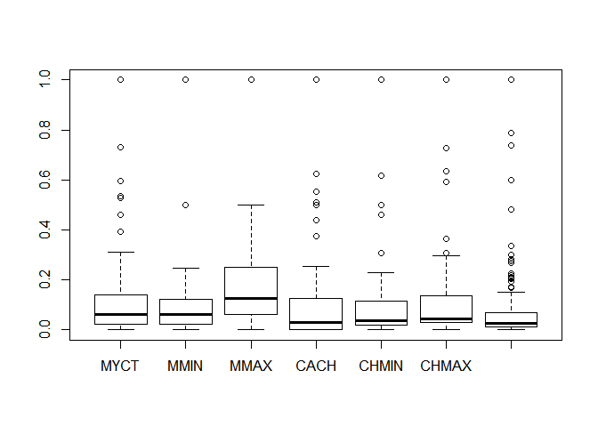
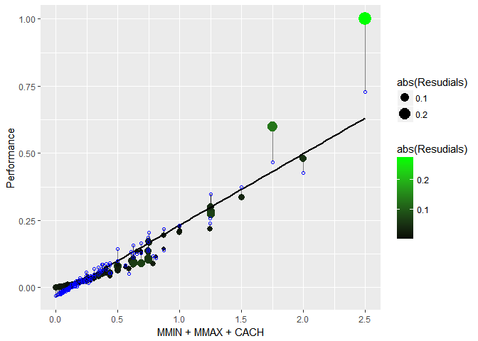

Linear Regression on CPU-Performance Dataset
================
Bhasheyam Krishnan

Loading the dataset

``` r
cpu = read.csv(file = "CPUPerformance.csv")
head(cpu)
```

    ##    Vendor MYCT MMIN  MMAX CACH CHMIN CHMAX Performance
    ## 1 adviser  125  256  6000  256    16   128         199
    ## 2  amdahl   29 8000 32000   32     8    32         253
    ## 3  amdahl   29 8000 32000   32     8    32         253
    ## 4  amdahl   29 8000 32000   32     8    32         253
    ## 5  amdahl   29 8000 16000   32     8    16         132
    ## 6  amdahl   26 8000 32000   64     8    32         290

``` r
nacheck = function(x){
  if (is.numeric(x)){
    mean(x)
    }
  
}

apply(cpu,2,nacheck)
```

    ## NULL

``` r
cpu[cpu == ""] = NA
sum(is.na(cpu))
```

    ## [1] 0

``` r
sum(is.null(cpu))
```

    ## [1] 0

the dataset has no NA and missing values

``` r
summary(cpu)
```

    ##        Vendor         MYCT             MMIN            MMAX      
    ##  ibm      : 32   Min.   :  17.0   Min.   :   64   Min.   :   64  
    ##  nas      : 19   1st Qu.:  50.0   1st Qu.:  768   1st Qu.: 4000  
    ##  honeywell: 13   Median : 110.0   Median : 2000   Median : 8000  
    ##  ncr      : 13   Mean   : 203.8   Mean   : 2868   Mean   :11796  
    ##  sperry   : 13   3rd Qu.: 225.0   3rd Qu.: 4000   3rd Qu.:16000  
    ##  siemens  : 12   Max.   :1500.0   Max.   :32000   Max.   :64000  
    ##  (Other)  :107                                                   
    ##       CACH            CHMIN            CHMAX         Performance     
    ##  Min.   :  0.00   Min.   : 0.000   Min.   :  0.00   Min.   :  15.00  
    ##  1st Qu.:  0.00   1st Qu.: 1.000   1st Qu.:  5.00   1st Qu.:  28.00  
    ##  Median :  8.00   Median : 2.000   Median :  8.00   Median :  45.00  
    ##  Mean   : 25.21   Mean   : 4.699   Mean   : 18.27   Mean   :  99.33  
    ##  3rd Qu.: 32.00   3rd Qu.: 6.000   3rd Qu.: 24.00   3rd Qu.: 101.00  
    ##  Max.   :256.00   Max.   :52.000   Max.   :176.00   Max.   :1238.00  
    ## 

The above is the stat of the datset

``` r
dim(cpu)
```

    ## [1] 209   8

``` r
boxplot(Filter(is.numeric,cpu))
```


From the above we can see almost every features has some outlier

so lets normalize the data see how it works

``` r
calculatenorm=function(x){
  num=x-min(x)
  denom=max(x)-min(x)
  return (num/denom)
}

normalizeset= as.data.frame(lapply(Filter(is.numeric,cpu),calculatenorm))
nrow(normalizeset)
```

    ## [1] 209

``` r
boxplot(Filter(is.numeric,normalizeset))
```



``` r
summary(normalizeset)
```

    ##       MYCT              MMIN              MMAX              CACH        
    ##  Min.   :0.00000   Min.   :0.00000   Min.   :0.00000   Min.   :0.00000  
    ##  1st Qu.:0.02225   1st Qu.:0.02204   1st Qu.:0.06156   1st Qu.:0.00000  
    ##  Median :0.06271   Median :0.06062   Median :0.12412   Median :0.03125  
    ##  Mean   :0.12598   Mean   :0.08780   Mean   :0.18350   Mean   :0.09846  
    ##  3rd Qu.:0.14026   3rd Qu.:0.12325   3rd Qu.:0.24925   3rd Qu.:0.12500  
    ##  Max.   :1.00000   Max.   :1.00000   Max.   :1.00000   Max.   :1.00000  
    ##      CHMIN             CHMAX          Performance     
    ##  Min.   :0.00000   Min.   :0.00000   Min.   :0.00000  
    ##  1st Qu.:0.01923   1st Qu.:0.02841   1st Qu.:0.01063  
    ##  Median :0.03846   Median :0.04545   Median :0.02453  
    ##  Mean   :0.09036   Mean   :0.10380   Mean   :0.06895  
    ##  3rd Qu.:0.11538   3rd Qu.:0.13636   3rd Qu.:0.07032  
    ##  Max.   :1.00000   Max.   :1.00000   Max.   :1.00000

``` r
plot(normalizeset)
```


``` r
normalizeset = normalizeset[normalizeset$CHMAX < 0.50,]
nrow(normalizeset)
```

    ## [1] 202

``` r
boxplot(normalizeset)
```


``` r
cor(normalizeset)
```

    ##                   MYCT       MMIN       MMAX       CACH      CHMIN
    ## MYCT         1.0000000 -0.3329035 -0.3899625 -0.3319191 -0.3540776
    ## MMIN        -0.3329035  1.0000000  0.8025779  0.6103571  0.7224964
    ## MMAX        -0.3899625  0.8025779  1.0000000  0.5514831  0.6425296
    ## CACH        -0.3319191  0.6103571  0.5514831  1.0000000  0.5986108
    ## CHMIN       -0.3540776  0.7224964  0.6425296  0.5986108  1.0000000
    ## CHMAX       -0.3516515  0.4210571  0.4720968  0.4122447  0.5704993
    ## Performance -0.2957514  0.9207077  0.8787207  0.6716335  0.7457215
    ##                  CHMAX Performance
    ## MYCT        -0.3516515  -0.2957514
    ## MMIN         0.4210571   0.9207077
    ## MMAX         0.4720968   0.8787207
    ## CACH         0.4122447   0.6716335
    ## CHMIN        0.5704993   0.7457215
    ## CHMAX        1.0000000   0.4750614
    ## Performance  0.4750614   1.0000000

From the above we can see, we cannot see any feature pair are highly corelated

``` r
plot(normalizeset$MYCT, normalizeset$MMAX)
```


``` r
normalizeset = subset(normalizeset,select = c("MMIN","MMAX" ,"CACH","CHMIN", "CHMAX", "Performance"))
```

``` r
cputrain = normalizeset
```

``` r
cpufit = lm(Performance ~ . , data = cputrain)
summary(cpufit)
```

    ## 
    ## Call:
    ## lm(formula = Performance ~ ., data = cputrain)
    ## 
    ## Residuals:
    ##       Min        1Q    Median        3Q       Max 
    ## -0.067291 -0.010826  0.001904  0.014499  0.265688 
    ## 
    ## Coefficients:
    ##              Estimate Std. Error t value Pr(>|t|)    
    ## (Intercept) -0.032992   0.003460  -9.536  < 2e-16 ***
    ## MMIN         0.434580   0.034470  12.608  < 2e-16 ***
    ## MMAX         0.231085   0.023016  10.040  < 2e-16 ***
    ## CACH         0.090315   0.020692   4.365 2.06e-05 ***
    ## CHMIN        0.092986   0.037684   2.468   0.0145 *  
    ## CHMAX       -0.002035   0.033860  -0.060   0.9521    
    ## ---
    ## Signif. codes:  0 '***' 0.001 '**' 0.01 '*' 0.05 '.' 0.1 ' ' 1
    ## 
    ## Residual standard error: 0.03083 on 196 degrees of freedom
    ## Multiple R-squared:  0.9174, Adjusted R-squared:  0.9153 
    ## F-statistic: 435.3 on 5 and 196 DF,  p-value: < 2.2e-16

From the above foolowing are the observations: we can eliminate the CHMIN and CHMAX as they have higher P - Value R- Square and Adj- R- Square are Very high seems like overfit

``` r
cpufit1 = lm(Performance ~  MMIN +MMAX + CACH  , data = cputrain)
summary(cpufit1)
```

    ## 
    ## Call:
    ## lm(formula = Performance ~ MMIN + MMAX + CACH, data = cputrain)
    ## 
    ## Residuals:
    ##       Min        1Q    Median        3Q       Max 
    ## -0.073649 -0.011503  0.000896  0.015038  0.272430 
    ## 
    ## Coefficients:
    ##              Estimate Std. Error t value Pr(>|t|)    
    ## (Intercept) -0.031262   0.003247  -9.628  < 2e-16 ***
    ## MMIN         0.468331   0.032090  14.594  < 2e-16 ***
    ## MMAX         0.237977   0.022678  10.494  < 2e-16 ***
    ## CACH         0.105049   0.020065   5.235 4.18e-07 ***
    ## ---
    ## Signif. codes:  0 '***' 0.001 '**' 0.01 '*' 0.05 '.' 0.1 ' ' 1
    ## 
    ## Residual standard error: 0.03121 on 198 degrees of freedom
    ## Multiple R-squared:  0.9145, Adjusted R-squared:  0.9132 
    ## F-statistic: 705.5 on 3 and 198 DF,  p-value: < 2.2e-16

``` r
par(mfrow = c(2, 2)) 
plot(cpufit) 
```


``` r
par(mfrow = c(2, 2))  
plot(cpufit1) 
```


``` r
cputrain$predicted = predict(cpufit1)
cputrain$Resudials = residuals(cpufit1)
```

``` r
library(dplyr)
```

    ## Warning: package 'dplyr' was built under R version 3.4.3

    ## 
    ## Attaching package: 'dplyr'

    ## The following objects are masked from 'package:stats':
    ## 
    ##     filter, lag

    ## The following objects are masked from 'package:base':
    ## 
    ##     intersect, setdiff, setequal, union

``` r
cputrain %>% select(Performance, predicted, Resudials) %>%head()
```

    ##   Performance predicted    Resudials
    ## 2  0.19460343 0.2171169 -0.022513471
    ## 3  0.19460343 0.2171169 -0.022513471
    ## 4  0.19460343 0.2171169 -0.022513471
    ## 5  0.09566639 0.1575631 -0.061896721
    ## 6  0.22485691 0.2302480 -0.005391139
    ## 7  0.29926410 0.3475654 -0.048301269

``` r
library(ggplot2)
ggplot(cputrain, aes(x =  MMIN + MMAX + CACH, y = Performance )) +
  geom_point() 
```


``` r
ggplot(cputrain, aes(x =  MMIN + MMAX + CACH, y = Performance )) +geom_point()+ geom_point(aes(y = predicted), shape = 1) 
```


``` r
ggplot(cputrain, aes(x =  MMIN + MMAX + CACH, y = Performance ))+ geom_segment(aes(xend = MMIN + MMAX + CACH, yend = predicted), alpha = .5)+geom_smooth(method = "lm", se = FALSE, color = "black") +geom_point(color = "blue")+ geom_point(aes(y = predicted), shape = 1, color =" red") 
```


The above is the difference between the actual points Blue and Predicited Points Red and the linear regression lm is show in Black color

``` r
barplot(cputrain$Resudials)
```

 From the above we can see the resudial is somewhat evenly distributed also we can find negative effict which will detect prediction with lower than the actual. which actually better than to have higher performance result and lower performance in actual.

``` r
ggplot(cputrain, aes(x =  MMIN + MMAX + CACH, y = Performance ))+ geom_segment(aes(xend = MMIN + MMAX + CACH, yend = predicted), alpha = .5)+geom_point(aes(color = abs(Resudials), size = abs(Resudials))) + # size also mapped
  scale_color_continuous(low = "black", high = "green") +geom_smooth(method = "lm", se = FALSE, color = "black") + geom_point(aes(y = predicted), shape = 1, color =" blue") 
```



The above plot is visuvialsation of Residuvals

``` r
fix(cputrain)
```

``` r
library("magrittr")
```

    ## Warning: package 'magrittr' was built under R version 3.4.3

``` r
library("tidyr")
```

    ## Warning: package 'tidyr' was built under R version 3.4.3

    ## 
    ## Attaching package: 'tidyr'

    ## The following object is masked from 'package:magrittr':
    ## 
    ##     extract

``` r
cputrain %>% gather (-Performance,-CHMAX, -CHMIN,-predicted, -Resudials,key = "iv", value = "x" ) %>% 
  
  ggplot( aes(x =  x, y = Performance ))+ geom_segment(aes(xend = x, yend = predicted), alpha = .5)+geom_point(aes(color = abs(Resudials), size = abs(Resudials))) + # size also mapped
  scale_color_continuous(low = "black", high = "green") +geom_smooth(method = "lm", se = FALSE, color = "black") + geom_point(aes(y = predicted), shape = 1, color =" blue") + facet_grid(~ iv , scales = "free_x") 
```


gather(key = "iv", value = "x", -mpg, -predicted, -residuals)
